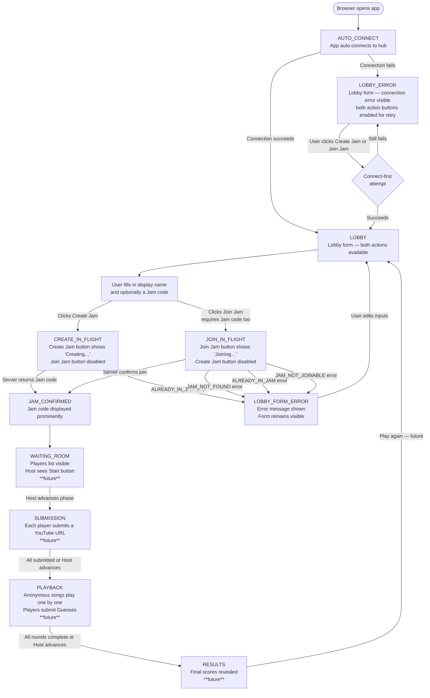

# User Flow

> This document defines the complete user journey through YtGuessWho, from first page load to game completion.
> It covers all implemented screens and all planned future screens. Unimplemented states are marked **[future]**.
> Game phases and event names reference `docs/context.md` — they are not redefined here.

---

## 1. Overview

A user opens the application in their browser. The app immediately attempts to connect to the game server over WebSocket. While connecting, the lobby form is visible but actions are blocked. Once connected — or if the connection attempt fails — the user sees the lobby form in its interactive or error state respectively.

From the lobby, the user either **creates a new Jam** (becoming the Host) or **joins an existing Jam** by entering a Jam code. Both actions share the same success destination: a screen that prominently displays the Jam code for sharing or confirmation.

After that, the user waits in a lobby room until the Host starts the game, then progresses through Submission, Playback & Guessing, and Results phases.

---

## 2. Flow Diagram

---

## 3. State Descriptions

### `AUTO_CONNECT` — Connecting on load

**What the user sees:**
The lobby form renders immediately. The "Create Jam" and "Join Jam" buttons are enabled (the app will attempt to connect automatically when either is clicked). If the connection is in progress (`isTransitioning`), both buttons are disabled. There is no full-screen loading overlay — the form is the only thing on screen.

**What the user can do:**
Nothing until the connection resolves or fails. If both buttons are disabled due to `isTransitioning`, the user waits.

**Exit transition:**
Connection resolves → `LOBBY` or `LOBBY_ERROR`.

---

### `LOBBY` — Lobby form, connected

**What the user sees:**
A vertically centred form containing:
- A "Your display name" labelled text input.
- A "Jam code" labelled text input.
- Two buttons side by side: **Create Jam** and **Join Jam**.

**Create Jam** is enabled when: display name is non-empty (after trimming) AND no action is in-flight AND hub is not transitioning.
**Join Jam** is enabled when: display name is non-empty AND Jam code is non-empty (after trimming) AND no action is in-flight AND hub is not transitioning.

No error message is visible.

**Exit transitions:**
- Create Jam clicked → `CREATE_IN_FLIGHT`
- Join Jam clicked → `JOIN_IN_FLIGHT`

---

### `LOBBY_ERROR` — Lobby form, connection error

**What the user sees:**
The same lobby form as `LOBBY`, plus an error message below the button row describing the connection failure. Both action buttons remain enabled so the user can retry — clicking either button triggers a fresh connection attempt before the action.

**Exit transition:**
Either button clicked → triggers connect-first attempt → `LOBBY` (on success) or remains in `LOBBY_ERROR` (on continued failure).

---

### `CREATE_IN_FLIGHT` — Creating a Jam

**What the user sees:**
The "Create Jam" button label changes to "Creating…" and the button is disabled. The "Join Jam" button is also disabled. The form inputs remain visible and readable but should not be interactable during the in-flight state.

**Exit transitions:**
- Server returns Jam code → `JAM_CONFIRMED`
- Server returns error → `LOBBY_FORM_ERROR`

---

### `JOIN_IN_FLIGHT` — Joining a Jam

**What the user sees:**
The "Join Jam" button label changes to "Joining…" and the button is disabled. The "Create Jam" button is also disabled.

**Exit transitions:**
- Server confirms join → `JAM_CONFIRMED`
- Server returns error → `LOBBY_FORM_ERROR`

---

### `LOBBY_FORM_ERROR` — Action failed

**What the user sees:**
The lobby form remains fully visible. An error message appears below the button row. Both buttons return to their enabled/disabled state based on the input values (same rules as `LOBBY`). The error message remains until the user successfully completes an action.

**Exit transition:**
User edits inputs or clicks a re-enabled button → triggers a new action → clears the error message on the next attempt.

---

### `JAM_CONFIRMED` — Jam created or joined

**What the user sees:**
The entire form disappears. In its place, centred on the screen:
- A small label: "Your Jam code"
- The six-character Jam code in a large, prominent display.
- A hint: "Share this code with your friends so they can join."

The Jam code display animates in (see `docs/design/look-and-feel.md` — Motion & Animation).

**Exit transition:**
`PlayerJoined` events from other players populate the waiting room → `WAITING_ROOM` **[future]**.

---

### `WAITING_ROOM` — Lobby room, waiting for players **[future]**

**What the user sees:**
The Jam code remains visible at the top (smaller than in `JAM_CONFIRMED`, but still readable). Below it, a list of connected Players is shown with their display names. The Host sees a "Start Game" button; other Players see a "Waiting for host…" status.

**Exit transition:**
Host clicks Start Game → `SUBMISSION`.

---

### `SUBMISSION` — Song submission phase **[future]**

**What the user sees:**
A YouTube URL text input and a "Submit Song" button. After submission, the input is replaced with a confirmation and a "Waiting for others…" status.

**Exit transition:**
All Players submit → `PLAYBACK`.

---

### `PLAYBACK` — Playback and guessing phase **[future]**

**What the user sees:**
An embedded YouTube player (or a YouTube link) showing an anonymous song. Below it, a list of Players to guess from. A "Submit Guess" button.

**Exit transition:**
All rounds complete → `RESULTS`.

---

### `RESULTS` — Final scores **[future]**

**What the user sees:**
A leaderboard of all Players with their final Scores, in descending order. The correct attribution for each Round is revealed. A "Play Again" option is shown.

**Exit transition:**
Play Again → resets to `LOBBY`.

---

## 4. Error States

All error messages appear inline below the button row in the lobby form. There are no full-screen error overlays in V1. The user must always be able to recover without refreshing the page.

| Error code | Trigger | User-visible message (guidance — exact copy is Dev's choice) | Recovery path |
|------------|---------|--------------------------------------------------------------|---------------|
| Connection failed | Auto-connect or button-triggered connect fails | "Could not connect to the server. Please try again." | Click either action button to retry |
| `JAM_NOT_FOUND` | Join Jam called with a code that matches no active Jam | "No Jam with that code was found. Check the code and try again." | User corrects the Jam code input and retries |
| `ALREADY_IN_JAM` | Create or Join called when the connection is already associated with a Jam | "You are already in an active Jam." | User must refresh the page to reset their connection (V1 — reconnection is out of scope) |
| `JAM_NOT_JOINABLE` | Join Jam called on a Jam that is not in the Lobby phase | "This Jam has already started and is not accepting new players." | User must ask the Host to share a new Jam |
| Hub invoke fails (non-specific) | Unexpected server error | "Something went wrong. Please try again." | User retries the action |

